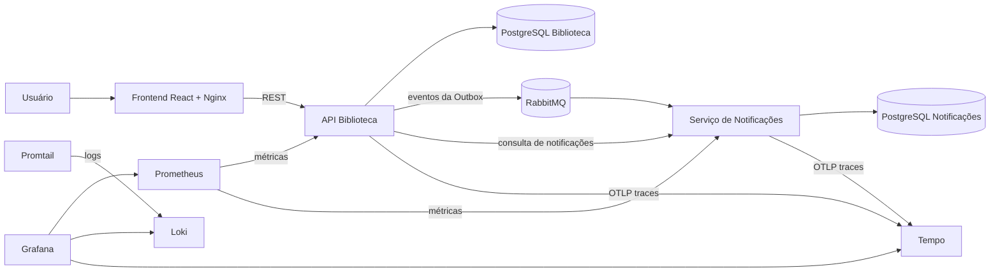

# Sistema de Biblioteca — TP5

Aplicação de biblioteca preparada para operação em contêineres, com orquestração Kubernetes, observabilidade, testes automatizados e pipeline de CI/CD.

## Arquitetura



O frontend faz o proxy das chamadas `/api` para a API principal. Cada microsserviço possui seu próprio banco PostgreSQL. Empréstimos e devoluções são publicados no RabbitMQ pelo padrão Transactional Outbox e consumidos de forma idempotente pelo serviço de notificações.

## Docker Compose

Requisitos: Docker, Docker Compose e `curl`.

```bash
cp .env.example .env
docker compose up -d --build
docker compose ps
```

As variáveis do arquivo `.env` são opcionais para a execução local; os valores de demonstração já possuem padrões no Compose.

| Componente | Endereço |
| --- | --- |
| Aplicação | http://localhost:4373 |
| API Biblioteca | http://localhost:8380 |
| API Notificações | http://localhost:8381 |
| RabbitMQ Management | http://localhost:15673 |
| Grafana | http://localhost:3001 |
| Prometheus | http://localhost:9091 |
| Loki | http://localhost:3100 |
| Tempo | http://localhost:3200 |

As credenciais locais do RabbitMQ são `biblioteca` / `biblioteca`. No Grafana, use `admin` / `admin`.

Para encerrar:

```bash
docker compose down
```

O parâmetro `-v` também remove os volumes e os dados persistidos.

## Kubernetes

Os manifestos em `k8s/` usam Kustomize e incluem Namespace, Secrets, ConfigMaps, StatefulSets, Deployments, Services, Ingress, probes, limites de recursos, PodDisruptionBudgets e HorizontalPodAutoscalers. Backend, frontend e notificações começam com duas réplicas. Backend e notificações podem escalar de duas a cinco réplicas quando a utilização média de CPU passa de 70%.

### Execução com Minikube

```bash
minikube start --driver=docker --cpus=4 --memory=6144
minikube addons enable metrics-server
minikube addons enable ingress

minikube image build -t biblioteca-backend:local backend
minikube image build -t biblioteca-notificacoes:local notificacoes-service
minikube image build -t biblioteca-frontend:local frontend

kubectl apply -k k8s
kubectl -n biblioteca get pods
kubectl -n biblioteca get deployments,statefulsets,services
kubectl -n biblioteca get hpa,pdb
```

Para acessar a aplicação e o Grafana sem alterar o arquivo de hosts:

```bash
kubectl -n biblioteca port-forward service/frontend 8080:8080
kubectl -n biblioteca port-forward service/grafana 3000:3000
```

A aplicação ficará em `http://localhost:8080` e o Grafana em `http://localhost:3000`. Para observar uma alteração manual de escala:

```bash
kubectl -n biblioteca scale deployment/backend --replicas=3
kubectl -n biblioteca rollout status deployment/backend
kubectl -n biblioteca get pods -l app=backend
```

O HPA pode voltar a ajustar a quantidade de réplicas de acordo com as métricas de CPU.

Os Secrets em `k8s/01-configuration.yml` possuem valores exclusivos para demonstração local. Em um cluster real, devem ser substituídos por um gerenciador de segredos.

## Monitoramento e rastreamento

O Spring Boot Actuator expõe health checks e métricas no formato Prometheus. As probes de liveness e readiness são usadas tanto pelo Docker quanto pelo Kubernetes.

- **Prometheus:** coleta métricas da JVM, HTTP e infraestrutura dos dois serviços.
- **Promtail e Loki:** agregam os logs dos contêineres e dos pods.
- **OpenTelemetry e Tempo:** registram traces distribuídos enviados por OTLP.
- **Grafana:** reúne métricas, logs e traces em uma única interface.

No Grafana, abra **Explore** e selecione:

- Loki, com a consulta `{service=~"backend|notificacoes-service"}` no Docker Compose;
- Tempo, usando **Search** e filtrando `resource.service.name` por `biblioteca` ou `notificacoes-service`;
- Prometheus, com a consulta `up` ou `http_server_requests_seconds_count`.

Os logs incluem `traceId` e `spanId`. O datasource Loki possui um campo derivado que abre diretamente no Tempo o trace associado à linha selecionada.

## Testes

Testes de unidade, integração web e persistência cobrem regras de empréstimo, histórico, Outbox, publicação, consumo idempotente e endpoints dos dois serviços.

```bash
cd backend
mvn verify

cd ../notificacoes-service
mvn verify

cd ../frontend
npm ci
npm run build
```

O teste de fumaça sobe toda a estrutura com Docker Compose, cadastra leitor e livro, registra empréstimo e devolução, aguarda os dois eventos no serviço de notificações e verifica métricas dos microsserviços:

```bash
./scripts/smoke-test.sh
```

## CI/CD com GitHub Actions

O workflow `.github/workflows/ci-cd.yml` é executado em pushes e pull requests para `main` ou `master`. Ele:

1. executa os testes Maven dos dois serviços;
2. instala as dependências e gera o build do frontend;
3. renderiza e valida os manifestos Kubernetes;
4. executa o cenário integrado com Docker Compose;
5. publica as três imagens no GitHub Container Registry em pushes;
6. realiza o deploy Kubernetes quando essa etapa é habilitada no repositório.

Para publicar em um repositório novo:

```bash
git init
git add .
git commit -m "Preparar sistema para operação"
git branch -M main
git remote add origin git@github.com:SEU_USUARIO/SEU_REPOSITORIO.git
git push -u origin main
```

O `GITHUB_TOKEN` fornecido pelo próprio workflow autentica a publicação no GHCR, sem necessidade de token pessoal.

O deploy é opcional. Para ativá-lo, crie no GitHub:

- variável de repositório `ENABLE_KUBERNETES_DEPLOY` com valor `true`;
- secret `KUBE_CONFIG` com o kubeconfig do cluster codificado em Base64.

Sem essas configurações, toda a integração contínua e a publicação das imagens continuam funcionando; apenas o job de deploy é ignorado.

## Estrutura

```text
.github/workflows/ci-cd.yml   pipeline de CI/CD
backend/                      API principal
frontend/                     interface React servida pelo Nginx
notificacoes-service/         consumidor dos eventos
k8s/                          implantação e escalabilidade no Kubernetes
monitoring/                   Prometheus, Loki, Promtail, Tempo e Grafana
scripts/smoke-test.sh         teste integrado do ambiente
docker-compose.yml            ambiente local completo
```
